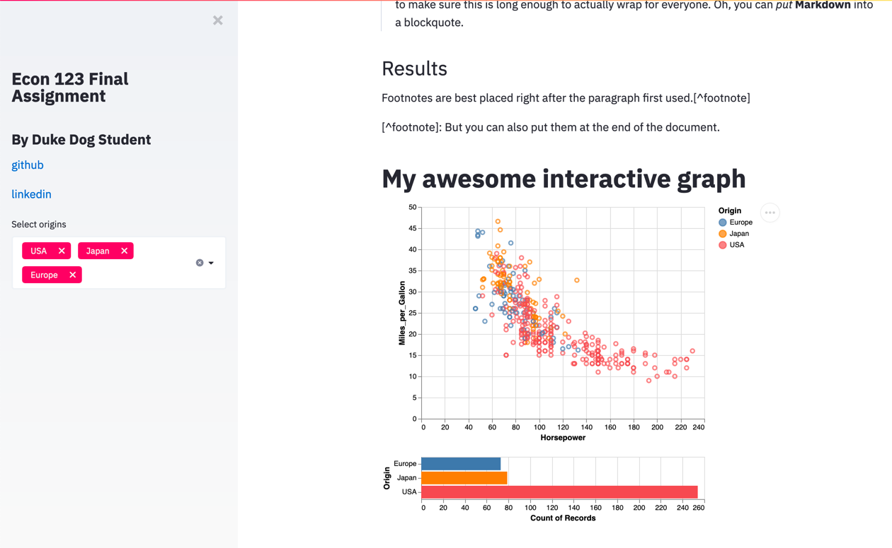

# How to build and post a dynamic econ paper

Wouldn't it be cool to share interactive analyses and code alongside your econ papers?

<p align="center"></p>

## Streamlit framework
For this tutorial, we'll use streamlit as the app framework

### Why streamlit? 

* Build apps quickly, without need for full app development team
* Build a demonstration
* Build just using python
* Build widgets and treat them as variables
* Cache data easily

*It's really fast to develop an app with limited functionality and very little overhead*

### What streamlit is **not**

* Not a substitution for full featured UI frameworks (e.g. React)
* Not suitable for production in most cases

### Additional resources
* [Streamlit github](https://github.com/streamlit/streamlit)
* [Streamlit launch blog post](https://towardsdatascience.com/coding-ml-tools-like-you-code-ml-models-ddba3357eace)
* [awesome-streamlit](https://github.com/MarcSkovMadsen/awesome-streamlit) [](https://github.com/MarcSkovMadsen/awesome-streamlit)

### Visualization framework

For this tutorial we're using [altair](https://github.com/altair-viz/altair).

Altair is an alternative to plotting libraries you may be familiar with (e.g., Matplotlib, bokeh, Seaborn). It is a "simple, friendly and consistent and built on top of the powerful [Vega-Lite](https://github.com/vega/vega-lite) JSON specification. This elegant simplicity produces beautiful and effective visualizations with a minimal amount of code."

## Getting Started

It is recommended that you setup a new environment for your streamlit experiments.

If using anaconda:
```bash
conda create -n streamlit python=3.7
source activate streamlit

cd ~/streamlit_class
pip install -r requirements.txt
```
### Running locally

```bash
cd ~/streamlit_class
streamlit run paper.py #or class1-2.py or your streamlit app of choice
```

## Deploying to IBM Cloud using Cloud Foundry

You'll need the following:
* [IBM Cloud account (free tier available)](https://console.ng.bluemix.net/registration/)
* [Cloud Foundry CLI](https://github.com/cloudfoundry/cli#downloads)

Your app will need the following:
* [manifest.yml](/manifest.yml)
* [runtime.txt](/runtime.txt)
* [Procfile](/Procfile)
* [requirements.txt](/requirements.txt)
* [setup.py](/setup.py)
* [README.md](/README.md)

```bash
cd ~/streamlit_class
cf api https://api.ng.bluemix.net
cf login --sso
cf push
```